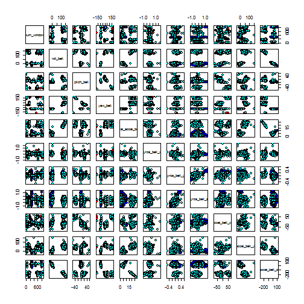
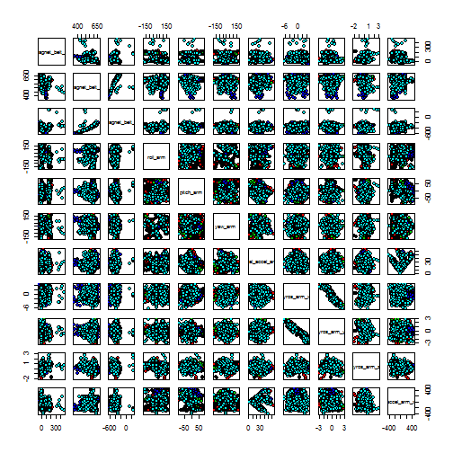
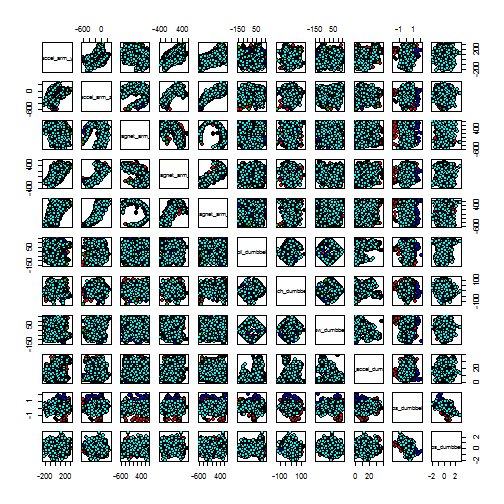
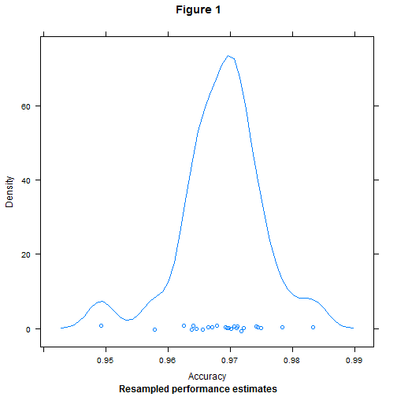

# **Human Activity Recognition Unilateral Dumbbell Biceps Curl**

### Summary

The objective of this project is to predict weather a Dumbbell Biceps Curl was properly executed. In order to do that, a machine learning algorithm will be used to predict when the exercise  was properly done (*Class A*), or if they made a mistake (*Class B to E*), our Data set consists of the information given by sensors attached to the body and/or dumbbell while the exercise  was done, and it was classified by a human (Personal Trainer).

### Data manipulation and training


The first thing we do is to load the training data and divide it. Usually 60% of it would be used as a training set, and 40% as a test set, but since this is a test, we will use 15% as training and 85% as testing for the validation of the dataset. 


The full dataset had 19622 observation, of which 2946 was use to train the model and 16676 was used to test the model, also we have a dataset of 20 to which we don't know the answer to, which will be used later for further tests.

We start with 159, but we remove timestamps and we also preprocess the data by removing the near zero variable ones, and also remove all the columns with more than 50% NA. *I will keep the username as a variable, but I will transform it into a dummy variable.* 


The number of variables ends up being 53.

Lets explore the Variables


   

```
##  result.train   num_window      roll_belt        pitch_belt      
##  A:837        Min.   :  1.0   Min.   :-28.90   Min.   :-53.9000  
##  B:570        1st Qu.:224.2   1st Qu.:  1.06   1st Qu.:  1.8125  
##  C:514        Median :420.5   Median :111.50   Median :  5.1300  
##  D:483        Mean   :428.6   Mean   : 63.53   Mean   :  0.2277  
##  E:542        3rd Qu.:643.0   3rd Qu.:123.00   3rd Qu.: 14.4000  
##               Max.   :864.0   Max.   :162.00   Max.   : 60.1000  
##     yaw_belt        total_accel_belt  gyros_belt_x      
##  Min.   :-178.000   Min.   : 0.00    Min.   :-1.040000  
##  1st Qu.: -88.300   1st Qu.: 3.00    1st Qu.:-0.030000  
##  Median : -15.650   Median :16.00    Median : 0.030000  
##  Mean   : -11.611   Mean   :11.22    Mean   :-0.007247  
##  3rd Qu.:   4.603   3rd Qu.:18.00    3rd Qu.: 0.110000  
##  Max.   : 179.000   Max.   :28.00    Max.   : 1.780000  
##   gyros_belt_y       gyros_belt_z      accel_belt_x      accel_belt_y   
##  Min.   :-0.53000   Min.   :-1.1800   Min.   :-83.000   Min.   :-31.00  
##  1st Qu.: 0.00000   1st Qu.:-0.1800   1st Qu.:-21.000   1st Qu.:  3.00  
##  Median : 0.02000   Median :-0.1000   Median :-15.000   Median : 31.00  
##  Mean   : 0.03907   Mean   :-0.1258   Mean   : -5.559   Mean   : 29.86  
##  3rd Qu.: 0.11000   3rd Qu.:-0.0200   3rd Qu.: -5.000   3rd Qu.: 61.00  
##  Max.   : 0.56000   Max.   : 1.3100   Max.   : 74.000   Max.   :150.00  
##   accel_belt_z     magnet_belt_x    magnet_belt_y   magnet_belt_z   
##  Min.   :-269.00   Min.   :-48.00   Min.   :363.0   Min.   :-618.0  
##  1st Qu.:-162.00   1st Qu.:  9.00   1st Qu.:581.0   1st Qu.:-377.0  
##  Median :-148.00   Median : 35.00   Median :601.0   Median :-319.0  
##  Mean   : -70.95   Mean   : 55.33   Mean   :594.2   Mean   :-344.8  
##  3rd Qu.:  28.00   3rd Qu.: 57.00   3rd Qu.:611.0   3rd Qu.:-306.0  
##  Max.   : 103.00   Max.   :474.00   Max.   :666.0   Max.   : 293.0  
##     roll_arm         pitch_arm          yaw_arm         total_accel_arm
##  Min.   :-177.00   Min.   :-88.200   Min.   :-180.000   Min.   : 1.00  
##  1st Qu.: -29.95   1st Qu.:-26.400   1st Qu.: -46.200   1st Qu.:17.00  
##  Median :   0.00   Median :  0.000   Median :   0.000   Median :27.00  
##  Mean   :  18.70   Mean   : -4.766   Mean   :  -3.442   Mean   :25.63  
##  3rd Qu.:  79.17   3rd Qu.: 10.475   3rd Qu.:  41.975   3rd Qu.:33.00  
##  Max.   : 180.00   Max.   : 85.100   Max.   : 180.000   Max.   :64.00  
##   gyros_arm_x        gyros_arm_y       gyros_arm_z       accel_arm_x     
##  Min.   :-6.37000   Min.   :-3.1000   Min.   :-2.0300   Min.   :-404.00  
##  1st Qu.:-1.29500   1st Qu.:-0.8200   1st Qu.:-0.0700   1st Qu.:-241.00  
##  Median : 0.10000   Median :-0.2600   Median : 0.2500   Median : -42.50  
##  Mean   : 0.07314   Mean   :-0.2686   Mean   : 0.2776   Mean   : -59.94  
##  3rd Qu.: 1.64000   3rd Qu.: 0.1100   3rd Qu.: 0.7200   3rd Qu.:  84.00  
##  Max.   : 4.62000   Max.   : 2.7900   Max.   : 2.9500   Max.   : 437.00  
##   accel_arm_y       accel_arm_z       magnet_arm_x     magnet_arm_y    
##  Min.   :-233.00   Min.   :-612.00   Min.   :-580.0   Min.   :-386.00  
##  1st Qu.: -52.00   1st Qu.:-142.75   1st Qu.:-297.8   1st Qu.: -12.75  
##  Median :  17.00   Median : -47.00   Median : 294.0   Median : 200.00  
##  Mean   :  33.89   Mean   : -72.53   Mean   : 194.1   Mean   : 155.80  
##  3rd Qu.: 141.00   3rd Qu.:  23.00   3rd Qu.: 634.8   3rd Qu.: 322.75  
##  Max.   : 303.00   Max.   : 271.00   Max.   : 779.0   Max.   : 582.00  
##   magnet_arm_z    roll_dumbbell     pitch_dumbbell     yaw_dumbbell     
##  Min.   :-595.0   Min.   :-153.71   Min.   :-130.10   Min.   :-140.565  
##  1st Qu.: 121.2   1st Qu.: -21.63   1st Qu.: -40.02   1st Qu.: -77.765  
##  Median : 436.5   Median :  47.96   Median : -20.80   Median :  -3.494  
##  Mean   : 302.7   Mean   :  22.87   Mean   : -10.55   Mean   :   1.497  
##  3rd Qu.: 542.0   3rd Qu.:  66.84   3rd Qu.:  17.17   3rd Qu.:  77.707  
##  Max.   : 693.0   Max.   : 151.35   Max.   : 127.93   Max.   : 154.952  
##  total_accel_dumbbell gyros_dumbbell_x  gyros_dumbbell_y  
##  Min.   : 0.00        Min.   :-1.8000   Min.   :-1.99000  
##  1st Qu.: 4.00        1st Qu.:-0.0200   1st Qu.:-0.18000  
##  Median :10.00        Median : 0.1400   Median : 0.03000  
##  Mean   :13.65        Mean   : 0.1716   Mean   : 0.03559  
##  3rd Qu.:19.00        3rd Qu.: 0.3700   3rd Qu.: 0.21000  
##  Max.   :39.00        Max.   : 2.1400   Max.   : 2.73000  
##  gyros_dumbbell_z  accel_dumbbell_x  accel_dumbbell_y  accel_dumbbell_z 
##  Min.   :-1.9400   Min.   :-237.00   Min.   :-182.00   Min.   :-272.00  
##  1st Qu.:-0.3300   1st Qu.: -50.00   1st Qu.:  -9.75   1st Qu.:-142.00  
##  Median :-0.1300   Median :  -9.00   Median :  41.00   Median :  -1.00  
##  Mean   :-0.1561   Mean   : -27.79   Mean   :  52.81   Mean   : -38.85  
##  3rd Qu.: 0.0300   3rd Qu.:  11.00   3rd Qu.: 112.00   3rd Qu.:  37.00  
##  Max.   : 1.3600   Max.   : 219.00   Max.   : 310.00   Max.   : 318.00  
##  magnet_dumbbell_x magnet_dumbbell_y magnet_dumbbell_z  roll_forearm    
##  Min.   :-630.0    Min.   :-737.0    Min.   :-249.0    Min.   :-180.00  
##  1st Qu.:-536.0    1st Qu.: 231.0    1st Qu.: -43.0    1st Qu.:   0.00  
##  Median :-479.0    Median : 310.0    Median :  16.0    Median :  23.65  
##  Mean   :-329.6    Mean   : 222.9    Mean   :  49.7    Mean   :  35.62  
##  3rd Qu.:-298.0    3rd Qu.: 389.0    3rd Qu.:  99.0    3rd Qu.: 141.00  
##  Max.   : 583.0    Max.   : 632.0    Max.   : 452.0    Max.   : 180.00  
##  pitch_forearm      yaw_forearm      total_accel_forearm gyros_forearm_x  
##  Min.   :-72.500   Min.   :-180.00   Min.   : 0.00       Min.   :-2.7000  
##  1st Qu.:  0.000   1st Qu.: -62.02   1st Qu.:30.00       1st Qu.:-0.2200  
##  Median :  8.955   Median :   0.00   Median :36.00       Median : 0.0500  
##  Mean   : 10.650   Mean   :  20.94   Mean   :34.72       Mean   : 0.1544  
##  3rd Qu.: 27.975   3rd Qu.: 109.00   3rd Qu.:41.00       3rd Qu.: 0.5600  
##  Max.   : 89.800   Max.   : 180.00   Max.   :79.00       Max.   : 3.5200  
##  gyros_forearm_y    gyros_forearm_z   accel_forearm_x   accel_forearm_y  
##  Min.   :-7.02000   Min.   :-2.2300   Min.   :-498.00   Min.   :-632.00  
##  1st Qu.:-1.46000   1st Qu.:-0.1800   1st Qu.:-174.00   1st Qu.:  66.25  
##  Median : 0.02000   Median : 0.0800   Median : -53.00   Median : 203.00  
##  Mean   : 0.05092   Mean   : 0.1441   Mean   : -58.11   Mean   : 166.86  
##  3rd Qu.: 1.59000   3rd Qu.: 0.4900   3rd Qu.:  86.00   3rd Qu.: 312.00  
##  Max.   : 6.01000   Max.   : 4.1000   Max.   : 352.00   Max.   : 589.00  
##  accel_forearm_z   magnet_forearm_x  magnet_forearm_y magnet_forearm_z
##  Min.   :-446.00   Min.   :-1270.0   Min.   :-877.0   Min.   :-966.0  
##  1st Qu.:-181.00   1st Qu.: -616.8   1st Qu.:  13.0   1st Qu.: 175.5  
##  Median : -37.00   Median : -356.5   Median : 599.0   Median : 511.0  
##  Mean   : -52.91   Mean   : -303.2   Mean   : 382.9   Mean   : 392.6  
##  3rd Qu.:  28.00   3rd Qu.:  -56.0   3rd Qu.: 735.0   3rd Qu.: 655.0  
##  Max.   : 277.00   Max.   :  672.0   Max.   :1480.0   Max.   :1070.0
```

 

# model

now lets build the model


```
## Loading required package: randomForest
## randomForest 4.6-10
## Type rfNews() to see new features/changes/bug fixes.
```


Then lets check the model


```r
modelFit
```

```
## Random Forest 
## 
## 2946 samples
##   53 predictor
##    5 classes: 'A', 'B', 'C', 'D', 'E' 
## 
## No pre-processing
## Resampling: Bootstrapped (25 reps) 
## 
## Summary of sample sizes: 2946, 2946, 2946, 2946, 2946, 2946, ... 
## 
## Resampling results across tuning parameters:
## 
##   mtry  Accuracy   Kappa      Accuracy SD  Kappa SD   
##    2    0.9515568  0.9386997  0.007031725  0.008848743
##   27    0.9686076  0.9602718  0.006679045  0.008428075
##   53    0.9616650  0.9514857  0.006857975  0.008650205
## 
## Accuracy was used to select the optimal model using  the largest value.
## The final value used for the model was mtry = 27.
```

```r
modelFit$finalModel
```

```
## 
## Call:
##  randomForest(x = x, y = y, mtry = param$mtry) 
##                Type of random forest: classification
##                      Number of trees: 500
## No. of variables tried at each split: 27
## 
##         OOB estimate of  error rate: 2.14%
## Confusion matrix:
##     A   B   C   D   E class.error
## A 836   0   0   0   1 0.001194743
## B  11 544  13   2   0 0.045614035
## C   0  12 497   3   2 0.033073930
## D   0   0   8 474   1 0.018633540
## E   0   5   2   3 532 0.018450185
```


```r
colnames(testing)[1] <- "classe"
predictions <- predict(modelFit,newdata=testing)
confusionMatrix(predictions, testing[,1])
```

```
## Confusion Matrix and Statistics
## 
##           Reference
## Prediction    A    B    C    D    E
##          A 4742   91    0    0    0
##          B    0 3068   54   20   16
##          C    0   61 2838   47    2
##          D    0    5   11 2665   16
##          E    1    2    5    1 3031
## 
## Overall Statistics
##                                           
##                Accuracy : 0.9801          
##                  95% CI : (0.9779, 0.9822)
##     No Information Rate : 0.2844          
##     P-Value [Acc > NIR] : < 2.2e-16       
##                                           
##                   Kappa : 0.9748          
##  Mcnemar's Test P-Value : NA              
## 
## Statistics by Class:
## 
##                      Class: A Class: B Class: C Class: D Class: E
## Sensitivity            0.9998   0.9507   0.9759   0.9751   0.9889
## Specificity            0.9924   0.9933   0.9920   0.9977   0.9993
## Pos Pred Value         0.9812   0.9715   0.9627   0.9881   0.9970
## Neg Pred Value         0.9999   0.9882   0.9949   0.9951   0.9975
## Prevalence             0.2844   0.1935   0.1744   0.1639   0.1838
## Detection Rate         0.2844   0.1840   0.1702   0.1598   0.1818
## Detection Prevalence   0.2898   0.1894   0.1768   0.1617   0.1823
## Balanced Accuracy      0.9961   0.9720   0.9840   0.9864   0.9941
```


```r
predictions.final <- predict(modelFit,newdata=pml.testing)
predictions.final
```

```
##  [1] B A A A A E D B A A B C B A E E A B B B
## Levels: A B C D E
```

```r
length(predictions.final)
```

```
## [1] 20
```

```r
pml_write_files = function(x){
  n = length(x)
  for(i in 1:n){
    filename = paste0("problem_id_",i,".txt")
    write.table(x[i],file=filename,quote=FALSE,row.names=FALSE,col.names=FALSE)
  }
}
pml_write_files(predictions.final)
```
